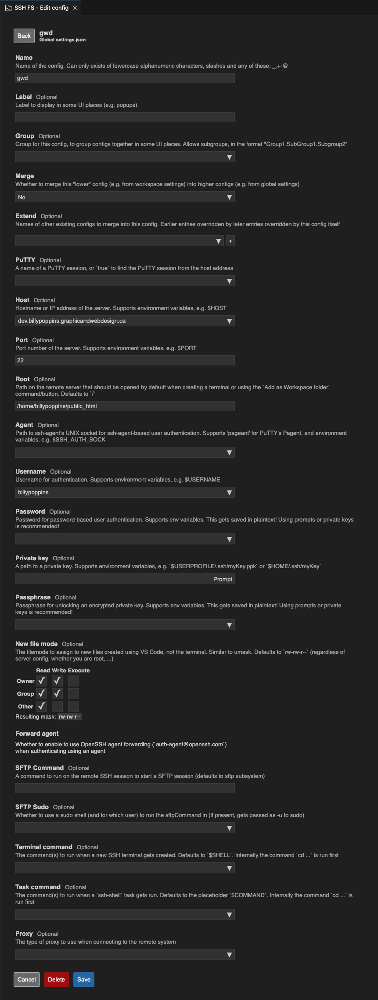

# Configuring SSH FS

[SSH FS is a useful VS Code extension](https://marketplace.visualstudio.com/items?itemName=Kelvin.vscode-sshfs) that lets users connect directly to their web server and edit files live. It basically adds built-in SSH/SFTP capabilities to the Visual Studio Code text editor.

## Warning

Editing code live on the server is not a recommended practice. If you do adopt live editing as part of your workflow, always create backups on a regular basis.

 
## 1. Configuring SSH FS using the settings.json file

You can easily create (and save) the appropriate SSH FS settings by adding these to the **settings.json** file. The default location for this file, on macOS, is: 

    /Users/bp1234567/Library/Application Support/Code/User/settings.json

You can also open the file by following these steps:

1. Go Code > Settings > Extensions
2. Click the gear icon next to SSH FS
3. Select "Settings"
4. Find "Sshfs: Configs"
5. Click "Edit in settings.json"

When manually adding the code below to the settings.json file, make sure no other code turns red.

        "sshfs.configs": [
                {
                    "name": "BillyPoppins",
                    "label": "BillyPoppins",
                    "host": "billy-poppins.graphicandwebdesign.ca",
                    "root": "/home/bp01234567/public_html/",
                    "username": "bp01234567",
                    "password": "*****************"
                }
            ],

## 2. Configuring by the UI

### Note

SSH FS has a bug whereby adding the initial configuration info into the GUI is broken by the fact that the Save button is disabled. If that happens, edit the file manually as in step 1, above.

